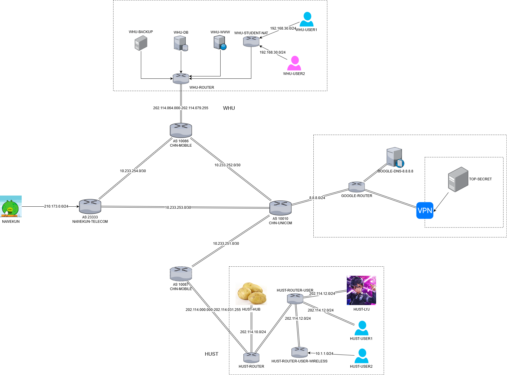

### Lab组2019秋季第3期新人任务

> 运维使我快乐

#### 0x01 简介 - 关于BGP

边界网关协议BGP（Border Gateway Protocol）是一种实现自治系统AS（Autonomous System）之间的路由可达，并选择最佳路由的距离矢量路由协议。

BGP配置不当会导致严重的后果。

> 2008年2月，巴基斯坦政府以视频网站YouTube有亵渎神明内容为理由命令网络服务商封锁YouTube。 巴基斯坦电信(Pakistan Telecom)试图限制本地用户接入YouTube，通过BGP向香港电信盈科（PCCW）发送新的路由信息（有错误）。然后PCCW向国际互联网广播了这个错误的路由信息。当时，巴基斯坦电信在路由器上加了条static route把208.65.153.0/24弄到了null0接口（黑洞路由）;巴电信的工程师手抖把static route redistribute到BGP了，也就是说把该路由器上的静态路由表添加到BGP的路由表了，静态路由同步到其他路由表里的优先值最高。BGP把这条路由向其他Peer AS的路由器同步了，最先中枪的是香港的电讯盈科（PCCW），然后接着被逐渐同步到了全世界。这时互联网的大部分用户想上Youtube的时候，数据包都丢到巴基斯坦某个路由器的null接口，结果当然是打不开。

同时利用BGP也可以完成对特定路由的挟持，从而监听其他AS之间传输的数据。

常见的攻击方式有：近邻AS通告抢夺、长掩码抢夺（吸虹效应） Special-Prefix hijack、AS_PATH hijack (沙丁鱼捕术)

#### 0x02 简介 - 任务要求

本次任务要求

1. 正确配置BGP，完成多个AS间的路由通信工作，建立正常工作的互联网
2. 配置网络服务，包括VPN、NAT、地址过滤、web服务等等
3. 利用长掩码抢夺，完成CHN-MOBILE到CHN-UNICOM的BGP挟持，使得NAIVEKUN-TELECOM得以窃听两AS间交换的数据

#### 0x03 要求 - 网络拓扑

#### 0x04 要求 - BGP部分

本例共有3个运营商，其中各运营商以及IP分配表如下

|info|CHN-MOBILE|CHN-UNICOM|NAIVEKUN-TELECOM|
|--|--|--|--|
|AS|10086/10087|10010|23333|
|IP Block|202.114.0.0/16|8.8.0.0/16|210.173.0.0/16|

运营商间物理接口关系如拓扑所示

#### 0x05 要求 - HUST部分

* 运营商CHN-MOBILE分配给HUST的IP段为`202.114.0.0-202.114.31.255`
* HUST的Server所在段为`202.114.10.0/24`
* HUST的学生区IP所在段为`202.114.12.0/24`

注意：HUST的学生区IP只允许HUST校内IP访问，即只有`202.114.0.0-202.114.31.255`可以访问`202.114.12.0/24`。Server区IP允许外网访问

* HUST WIRELESS分配的IP段为`10.1.1.0/24`，你需要在图中HUST-ROUTER-USER-WIRELESS建立NAT和DHCP

注意：学生要可以正常上网！(指访问8.8.8.8)

* 学生建议使用Alpine linux代替
* hub服务器使用`python3 -m http.server 80`简单开一个web服务即可

#### 0x06 要求 - Google部分

* 运营商CHN-UNICOM分配给Google的IP段为8.8.8.0/24
* 你需要选择合适的docker image搭建DNS服务，可不必接入真实公共网络
* VPN Server IP随意，在IP段内即可。WHU-USER2将访问VPN Server，建立VPN连接，进一步访问TOP Secret
* VPN协议要求使用OpenVPN

注意：VPN处可不必建立NAT，OpenVPN可以使用tun模式

TOP Secret服务器简单跑个python httpserver即可

#### 0x07 要求 - WHU部分

* 运营商CHN-MOBILE分配给WHU的IP段为`202.114.64.0-202.114.79.255`
* Backup需要配置一台FTP服务器
* DB需要配置数据库，可选MySQL，如果内存不够可忽略
* WWW简单跑python httpserver即可
* 以上三台服务器IP自拟，允许外网访问
* 在WHU-STUDENT-NAT处建立NAT，供WHU-USER**上网**
* WHU-USER1将访问WHU三台服务器
* WHU-USER2将访问Google VPN Server

注意：USER要正常上网

#### 0x08 要求 - 路由器

除NAT需求外，路由器要求使用quagga，可参考`docker-compose.yml`

有NAT需求的路由器可以使用debian等发行版

#### 0x09 要求 - BGP Hijack

此时大黑阔lyj正准备从WHU-BACKUP下载数据

假设你是攻击者`naivekun`，你有了操控`NAIVEKUN-TELECOM`路由器的权限。你需要污染AS10086和AS10010的BGP路由表，使得AS10010到AS10086这一跳变为`AS10010 - AS23333 - AS10086`

具体实现可以参考资料 - prefix hijack

当你成功挟持连接后，务必保证整个网络工作正常

此时需要使用libpcap库完成一个简单的抓包程序，部署在`NAIVEKUN-TELECOM`路由器上，抓取lyj登录WHU-BACKUP时发送的FTP密码

#### 0x10 可选要求 - 隐藏攻击者

由于挟持后路由多了一跳，使得ping的TTL减一，且TRACEROUTE也会发现经过了一个奇怪的IP。这有可能被lyj发现

你需要使用iptables的mangle表，修改TTL，使得ping得到的TTL和未挟持前一致，同时traceroute不会发现攻击者的IP，也和未挟持前一致

#### 0x11 参考资料

整个网络需要使用docker构建
`docker-compose.yml`演示了AS10010和AS10087和HUST的硬件网络配置

* 图解TCP/IP
* 自顶向下
* Docker && docker-compose
* google: bgp prefix hijacking

##### 网络功能说明

* lyj可以正常访问WHU-BACKUP
* WHU-USER1/2和HUST-USER1/2/lyj可以访问HUST-HUB
* 所有设备可以访问8.8.8.8
* WHU-USER2可以登录Google VPN Server并访问TOP-SECRET
* 除了HUST的IP，其他不能访问HUST学生区IP

##### Hint

实现起来有难度的话可以分而治之。

例如先完成一个nat/一个vpn server/一个as间路由交换。

或者先完成一个抓包程序

网络不通请使用三板斧：ping traceroute tcpdump

记得存路由器配置。。。重启可能会没了

##### ddl

预计2周，看完成情况调整